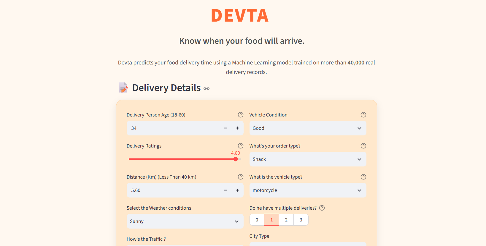
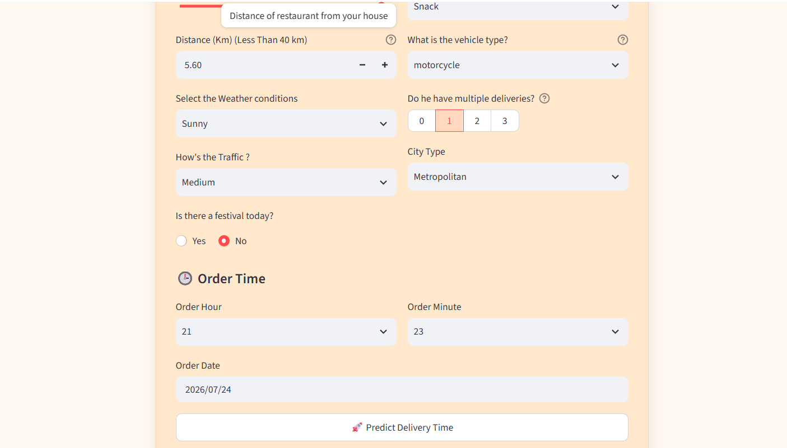
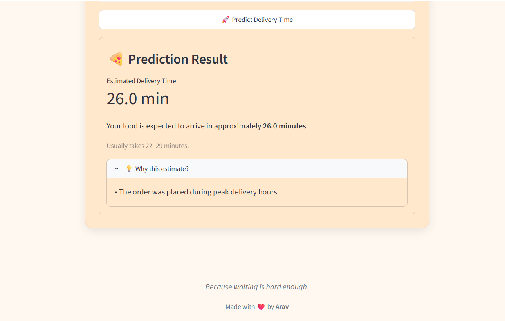

# 🚚 DEVTA
### A food delivery prediction model


## 📸 Screenshots






## 🌐 Live Demo

#### 🚀 Try the application here:

[Devta: The food delivery time prediction app](https://devtaapp.onrender.com/)


## 📖 Overview

Devta is an end-to-end machine learning application that estimates food delivery time based on order, traffic, weather, and delivery-related information. The project combines an XGBoost regression model with a FastAPI backend and an interactive Streamlit frontend to provide accurate delivery time predictions, an expected prediction range based on the model's RMSE, and simple explanations for the generated estimate.


## ✨ Features

- 🚚 Predicts food delivery time in minutes.
- ⚡ Powered by a tuned XGBoost regression model.
- 📊 Returns an expected delivery range using model RMSE.
- 💡 Provides simple explanations for the prediction.
- 🔄 Automatically preprocesses user input using the same pipeline as training.
- ✅ Validates user input with Pydantic.
- 🌐 FastAPI REST API for inference.
- 🎨 Interactive Streamlit frontend.
- 📦 Ready for Docker and cloud deployment.


## 🛠️ Tech Stack


### Frontend

- Streamlit

### Machine Learning

- XGBoost
- Scikit-Learn
- Pandas
- Numpy

### Backend

- FastAPI
- Joblib
- Pydantic
- Uvicorn


### Deployment  

- Deployed both frontend and backend on Render


## ⚙️ Machine Learning Pipeline

The prediction pipeline consists of the following stages:

1. Raw user input validation using Pydantic.
2. Feature renaming to match the training dataset.
3. Date-based feature engineering:
   - Day of Week
   - Weekend Detection
4. Custom feature engineering:
   - Peak Hour
   - Long Distance
   - Late Night Order
   - Busy Rider
   - Highly Rated Driver
5. One-Hot Encoding of categorical variables.
6. Feature alignment with the original training columns.
7. Prediction using the trained XGBoost model.
8. Generation of an expected delivery range using RMSE.
9. Generation of human-readable reasons behind the prediction.

## 🤖 Model Performance

| Metric | Score |
|--------|-------|
| Model | XGBoost Regressor |
| RMSE | 3.89 minutes |
| MAE | 3.10 minutes |
| R² Score | 0.82 |

The predicted delivery range is calculated using the model's RMSE:

```text
Expected Time = Prediction ± RMSE
```

## 📂 Dataset
This project is trained on the **India Food Delivery Time Prediction** dataset available on Kaggle.

- **Dataset:** [India Food Delivery Time Prediction](https://www.kaggle.com/datasets/changlechangsu/india-food-delivery-time-prediction)
- **Source:** Kaggle

Special thanks to the dataset creator for making the data publicly available.
